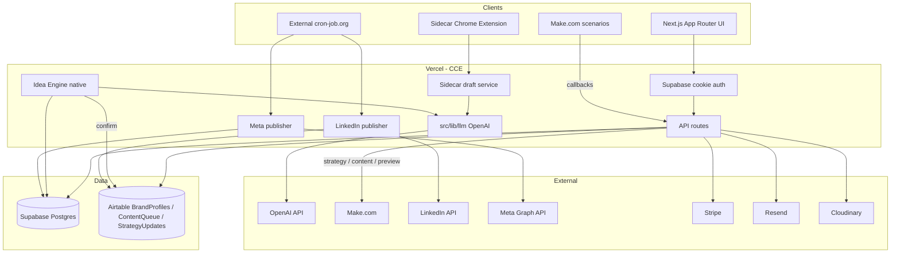

# CCE Architecture Audit

**Date:** 2026-08-31  
**Scope:** Production CrisP Content Engine (`crisp-content-engine@0.1.1`) as it exists before the Intelligence Foundation upgrade.  
**Rule:** This audit does not remove Make, Airtable, or any working path. It records what exists so new architecture can be added alongside it.

---

## 1. Stack summary

CCE is a **Next.js 16.1.6** App Router application (React 19, TypeScript, Tailwind 4) deployed on **Vercel**. There is **no `middleware.ts`**; authentication is enforced per page and per route.

| Layer | System of record today |
|---|---|
| Identity, billing, quotas, OAuth tokens, Idea Engine runs, Sidecar CRM, Meta jobs | **Supabase / Postgres** |
| Brands, master strategy JSON, content briefs, content queue, publish status | **Airtable** |
| Strategy generation, most content generation, preview packs, onboarding scrape | **Make.com webhooks** |
| Native LLM (Sidecar drafts + Idea Engine when native flag is on) | **OpenAI Chat Completions** in-process |
| LinkedIn + Meta publishing | **Native** CCE publishers (cron-triggered) |

One-line architecture:

```
User (Next.js UI)
  → Supabase Auth / entitlements
  → Airtable (brands, strategy, ContentQueue)
  → Make.com (most generation)
  → OpenAI (Sidecar + native Idea Engine)
  → Native LinkedIn/Meta publishers (cron)
```

---

## 2. Current architecture diagram



### Generation today (dominant path)

```
USER PROMPT / FORM
  → POST /api/content/generate  or  strategy approve / content-brief approve
  → Airtable BrandProfiles + recent ContentQueue
  → Make webhook
  → Make OpenAI module (outside this repo)
  → Airtable ContentQueue write
  → Make callback /api/content/webhook or /api/content/generation/complete
```

### Native Idea Engine (flagged)

```
USER INTENT
  → POST /api/idea-engine/run
  → idea_engine_runs / items in Supabase
  → OpenAI gpt-4o (default)
  → confirm → Airtable ContentQueue
```

---

## 3. Authentication flow

- **Provider:** Supabase Auth via `@supabase/ssr` + `@supabase/supabase-js`.
- **Browser:** `src/lib/supabase/client.ts`, session persistence in `src/components/SupabaseProvider.tsx`.
- **Server:** `src/lib/supabase/server.ts` (cookie SSR client).
- **Service role:** `src/lib/supabaseService.ts` / `src/lib/supabase/admin.ts` (bypasses RLS).
- **Callback:** `src/app/auth/callback/page.tsx` (`exchangeCodeForSession`).
- **UI:** `/sign-in`, `/signup`, password reset at `/api/auth/password/reset`.
- **Not user login:** LinkedIn OAuth (`/api/connections/linkedin/*`) and Meta OAuth (`/api/meta/oauth/*`) are publishing connections.

Protection is scattered: `(app)` pages call `getUser()` and redirect; API routes rebuild a cookie client and 401 if missing. There is no global middleware gate.

---

## 4. Every AI / model invocation

There is **one** in-process HTTP call to an AI provider:

`POST https://api.openai.com/v1/chat/completions` in `src/lib/llm/providers/openai.ts`.

It is used by two product features:

| Feature | Entry | Model (hard-coded default) | Temperature | Purpose |
|---|---|---|---|---|
| **Sidecar draft** | `POST /api/sidecar/draft` → `generateSidecarDraft` | `SIDECAR_LLM_MODEL` \|\| `SIDECAR_OPENAI_MODEL` \|\| **`gpt-4o-mini`** | 0.7 hard-coded | Conversational outreach/reply JSON |
| **Native Idea Engine** | `/api/idea-engine/run` execute/expand/retry/regenerate | `IDEA_ENGINE_LLM_MODEL` \|\| **`gpt-4o`** | env or 0.7 | Multi-channel series JSON, with one schema-repair retry |

Abstraction today: `src/lib/llm/` (`completeStructuredJson`). Anthropic/Gemini are typed stubs, not implemented. No Vercel AI SDK. No client-side model calls. The Chrome extension never holds `OPENAI_API_KEY`.

**Hard-coded model names in production TS:**

- `gpt-4o-mini` — Sidecar default (`src/lib/llm/index.ts`)
- `gpt-4o` — Idea Engine default (`src/lib/idea-engine/config.ts`)

All other generation (strategy, Quick Generate, content briefs, preview) invokes **Make**, which runs models outside this repository. Make scenario docs mention `gpt-4` in some runbooks; that is not executed by CCE code.

---

## 5. Every Sidecar AI invocation

| Path | Role |
|---|---|
| `src/lib/sidecar/draft.ts` | Only Sidecar LLM call |
| `src/lib/sidecar/promptBuilder.ts` | Prompt (no network) |
| `src/app/api/sidecar/draft/route.ts` | HTTP entry |
| `src/lib/llm/index.ts` `resolveSidecarLlmModel()` | Default **gpt-4o-mini** |

Related Sidecar APIs that do **not** call a model: `/api/sidecar/{config,brands,opportunity,contact,content-idea}`.

**Legacy assumption to upgrade:** Sidecar is pinned to `gpt-4o-mini` unless env is set. That is too small a model for conversational brand/content intelligence.

---

## 6. Make.com dependencies

Do **not** remove these. Classifications:

### Outbound webhooks (CCE → Make)

| Env var | Feature | Classification |
|---|---|---|
| `MAKE_STRATEGY_WEBHOOK_URL` | Strategy generation, monthly update, content-brief create | **CRITICAL** |
| `MAKE_CONTENT_GENERATION_WEBHOOK_URL` | Creator-plan content after strategy approve; auto-generate | **CRITICAL** |
| `MAKE_MULTI_CHANNEL_CONTENT_GENERATION_WEBHOOK_URL` | Growth/Pro/etc. Quick Generate | **CRITICAL** |
| `MAKE_WEBHOOK_STARTER` | Starter-plan generation | **IMPORTANT** |
| `MAKE_CONTENT_REGENERATE_WEBHOOK_URL` | Single-post regenerate | **IMPORTANT** |
| `MAKE_PREVIEW_WEBHOOK_URL` | Marketing preview packs | **IMPORTANT** |
| `MAKE_ONBOARDING_WEBHOOK_URL` | Optional scrape during onboarding | **OPTIONAL** |
| `MAKE_IDEA_ENGINE_SERIES_WEBHOOK_URL` | Legacy Idea Engine | **LEGACY** if `IDEA_ENGINE_NATIVE_ENABLED=true`, else **CRITICAL** |
| `CONTENT_CREATION_WEBHOOK_URL` | Alias in email helper | **LEGACY** alias |
| `MAKE_CONTENT_PUBLISH_WEBHOOK_URL` | Documented only; publishing is native | **LEGACY/UNKNOWN** |

### Inbound callbacks (Make → CCE)

| Route | Classification |
|---|---|
| `POST /api/strategy/webhook` | **CRITICAL** |
| `POST /api/content/webhook` | **CRITICAL** |
| `POST /api/content/generation/complete` | **CRITICAL** |
| `POST /api/content/generation/progress` | **IMPORTANT** |
| `POST /api/usage/increment` | **IMPORTANT** |
| `POST /api/email/content-batch-ready-hook` | **IMPORTANT** |
| `POST /api/preview/complete` | **IMPORTANT** |
| `GET/POST /api/social/linkedin/credentials` | **LEGACY** (native publish exists) |
| `/api/idea-engine/webhook/*` | **LEGACY** (410 when native) |

### Make secrets

`MAKE_STRATEGY_WEBHOOK_SECRET`, `MAKE_CALLBACK_SECRET`, `MAKE_CONTENT_WEBHOOK_SECRET`, `MAKE_SHARED_SECRET`, `MAKE_API_KEY`, `MAKE_PREVIEW_WEBHOOK_KEY`.

Trigger files (not exhaustive): `src/app/api/strategy/generate/route.ts`, `src/app/api/content/generate/route.ts`, `src/lib/contentBrief.ts`, `src/app/api/strategy/[id]/approve/route.ts`, `src/lib/operator/adapters/make.ts`.

---

## 7. Airtable dependencies

Shared client: `src/lib/airtable/client.ts`. Auth: `AIRTABLE_PAT` + `AIRTABLE_BASE_ID`.

| Table (env) | Logical name | Reads | Writes | Classification |
|---|---|---|---|---|
| `AIRTABLE_BRANDPROFILES_TABLE` | BrandProfiles | Almost every product flow | Onboarding, strategy patch/approve, webhook | **CRITICAL** |
| `AIRTABLE_CONTENTQUEUE_TABLE` | ContentQueue | Queue, schedule, publish, history, emails | Approve/edit, Idea Engine confirm, Sidecar ideas, publishers | **CRITICAL** |
| `AIRTABLE_STRATEGYUPDATES_TABLE` | StrategyUpdates / Content Briefs | Briefs list, monthly updates | Create/approve briefs, Make callbacks | **CRITICAL** |
| `AIRTABLE_STRATEGY_TABLE` | Optional strategy table | Content generate | — | **OPTIONAL** |
| `AIRTABLE_PREVIEW_LEADS_TABLE` (default `PreviewLeads`) | PreviewLeads | Preview funnel | Lead capture | **OPTIONAL** / marketing **IMPORTANT** |

Airtable is the **content system of record**. Native Supabase intelligence tables added in this upgrade sit **alongside** these tables. Mapping is via `airtable_brand_id` / `airtable_entity_map`. No Airtable data is moved or deleted.

---

## 8. Supabase tables (existing)

From `supabase/migrations/` and `.from()` usage:

`profiles`, `subscriptions`, `entitlements`, `usage_posts`, `usage_reservations`, `social_connections`, `strategy_notifications`, `plan_waitlist`, `preview_sessions`, `preview_packs`, `generation_jobs`, `generation_job_progress`, `meta_connections`, `meta_pages`, `meta_instagram_accounts`, `publish_jobs`, `trial_usage`, `idea_engine_runs`, `idea_engine_items`, `operator_action_logs`, `operator_idempotency_keys`, `operator_rate_limits`, `sidecar_engagement_opportunities`, `sidecar_contacts`, `sidecar_voice_examples`, `sidecar_usage_events`, `email_preferences`.

`generation_jobs` tracks **Make** multichannel jobs. It is not a general workflow engine.

---

## 9. Product flows

### Content generation (Make)

UI `src/app/(app)/content/generate/page.tsx` → `POST /api/content/generate` → caps + Airtable history → Make → callbacks → usage increment.

### Content generation (Idea Engine)

UI `src/app/(app)/content/idea-engine/page.tsx` → native OpenAI (or legacy Make) → confirm writes ContentQueue.

### Content editing / saving / approval

UI `src/app/(app)/content/approval/page.tsx` → `PATCH /api/content/queue/[contentId]` (`approve`, edits, image, regenerate). Status typically `Ready To Publish` or `Published` (blog). Email one-click: `/api/email-actions/content/approve`.

### Scheduling

UI calendar reads ContentQueue `scheduled_time`. `POST /api/content/schedule` is a **stub** (cap check + TODO). Real “schedule” is an Airtable datetime consumed by cron publishers.

### LinkedIn publishing

`GET/POST /api/publish/linkedin-due` (`X-Cron-Secret`) → due ContentQueue rows → `src/lib/linkedin/publish.ts` (UGC/org) → write post IDs/status back to Airtable. OAuth tokens live in Supabase `social_connections`.

### Analytics / performance ingestion

**Not implemented** for post performance. `LINKEDIN_ANALYTICS_SETUP.md` is a plan. Product analytics = Vercel Analytics + optional GA4. No `/api/analytics/linkedin`.

### Scheduled jobs

No Vercel `crons` in `vercel.json`. External cron hits: LinkedIn due, Meta due, strategy reminder, approval reminder, strategy auto-continue, content auto-publish, trial reminders.

---

## 10. Webhook endpoints

| Pattern | Auth |
|---|---|
| `/api/content/webhook` | `x-make-secret` |
| `/api/content/generation/{progress,complete}` | Make shared / API key |
| `/api/strategy/webhook` | `MAKE_CALLBACK_SECRET` |
| `/api/idea-engine/webhook/*` | Make (legacy) |
| `/api/stripe/webhook` | Stripe signature |
| `/api/email/content-batch-ready-hook` | Make |
| `/api/preview/complete` | Make shared |
| `/api/meta/data-deletion` | Meta compliance |

---

## 11. External API integrations

Supabase, Airtable, Make, OpenAI, LinkedIn, Meta Graph, Stripe, Resend, Cloudinary, Vercel Analytics. Channel registry also describes X/Blog; **X publish is not implemented**. Buffer is types/docs only.

---

## 12. Environment variables (observed)

**Supabase:** `NEXT_PUBLIC_SUPABASE_URL`, `NEXT_PUBLIC_SUPABASE_ANON_KEY`, `SUPABASE_SERVICE_ROLE_KEY`, `SUPABASE_URL`  
**App:** `NEXT_PUBLIC_APP_URL`, `NEXT_PUBLIC_SITE_URL`, `VERCEL_URL`  
**Airtable:** `AIRTABLE_PAT`, `AIRTABLE_BASE_ID`, `AIRTABLE_*_TABLE`, BrandProfiles field IDs  
**Make:** `MAKE_*_WEBHOOK_URL`, `MAKE_*_SECRET`, `MAKE_API_KEY`, `MAKE_WEBHOOK_STARTER`, `CONTENT_CREATION_WEBHOOK_URL`  
**LinkedIn:** `LINKEDIN_CLIENT_ID`, `LINKEDIN_CLIENT_SECRET`, `LINKEDIN_REDIRECT_URI`, `LINKEDIN_ENCRYPTION_KEY`  
**Meta:** `META_APP_ID`, `META_APP_SECRET`, `META_REDIRECT_URI`, `META_TOKEN_ENCRYPTION_KEY`, `META_PUBLISHING_ENABLED`, `NEXT_PUBLIC_META_PUBLISHING_ENABLED`  
**Stripe / email / Cloudinary / cron:** as in `.env.example` and route handlers  
**LLM:** `OPENAI_API_KEY`, `LLM_PROVIDER`, `SIDECAR_LLM_MODEL`, `SIDECAR_OPENAI_MODEL`, `IDEA_ENGINE_LLM_*`  
**Flags:** `IDEA_ENGINE_NATIVE_ENABLED`, `SIDECAR_API_ENABLED`, `OPERATOR_CONSOLE_ENABLED`

---

## 13. Business logic mixed into routes / UI

Heavy files (logic + I/O together):

- `src/app/api/publish/linkedin-due/route.ts` (~957)
- `src/app/api/content/queue/[contentId]/route.ts` (~735)
- `src/app/api/content/generate/route.ts` (~641)
- `src/app/api/onboarding/route.ts` (~518)
- UI: approval (~1538), idea-engine (~1596), onboarding (~1363), admin (~1008)

Cleaner extractions already exist for Idea Engine, Sidecar, caps, operator actions. New intelligence work should follow the **service layer** pattern, not grow these god-files.

---

## 14. Test setup before this upgrade

Vitest (`npm test`), `environment: 'node'`, `src/**/*.test.ts`. No Playwright/Cypress. Coverage is concentrated on Idea Engine, Sidecar prompt/schema, entitlements, and OpenAI timeout.

**Gap:** no automated tests for auth, Airtable CRUD, Make payload posting, LinkedIn publish, or approval PATCH. Phase 2 adds service-level regression tests around those contracts without requiring live credentials.

---

## 15. Implications for tonight’s upgrade

1. Keep Make + Airtable as the live generation/CMS path.
2. Introduce native Brand Brain / strategy / memory / briefs / jobs in **new Supabase tables**.
3. Centralise model roles so Sidecar is no longer stuck on `gpt-4o-mini` and no feature hard-codes model names.
4. Build generation as **intent → retrieval → structured brief → draft → review**, used by new services; do not rip out Make Quick Generate.
5. Performance, experiments, and learnings need a data model now; LinkedIn analytics ingestion remains a later connector.
6. Expose MCP-ready actions as server services so Telegram/MCP can be added without duplicating logic.
